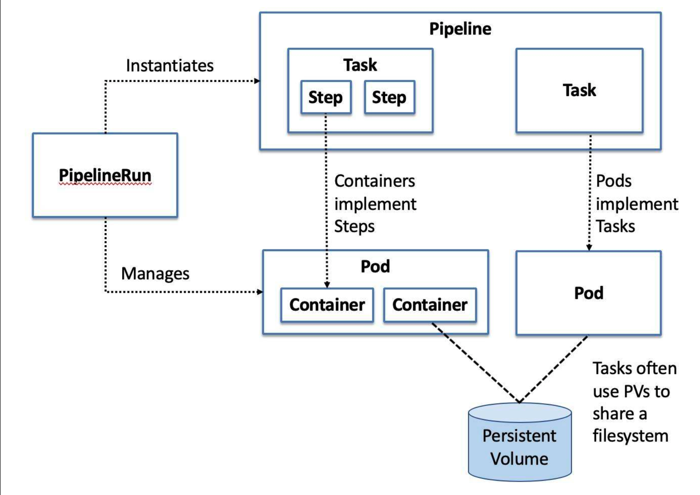
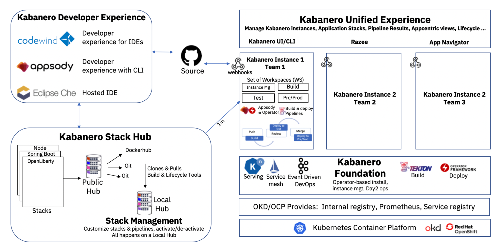

# Introduction
What is Tekton, Kabanero and Appsody?  You can think of Tekton as a very powerful but yet flexible open-source framework for creating continuous integration and delivery (CI/CD) systems.  It lets you build, test and deploy across multiple cloud providers such as the IBM Public Cloud, Private Cloud, AWS, Azure etc.  It achieves this by abstracting away the underlying implementation details.  Kabanero provides a set of pre-built pipelines and tasks. It delivers new and existing middleware tools to modernize your cloud journey.  Appsody includes a set of tools and capabilities you can use to build cloud native applications and custom stacks.


In a nutshell Tekton is composed of Pipelines, PipelineRuns, Tasks, TaskRuns, TriggerBindings, TriggerEvents, Fig 1. provides more detail. Fig 2 provides an architecture overview of Kabanero.


### Fig 1. Tekton Overview
 

### Fig 2. Kabanero Arch Overview
 


### Prereqs
Openshift ICP4A (Cloudpak for Apps) or a local instance of minikube with Kabanero 0.6.0 installed


# How to integrate custom pipelines with Kabanero ~ 15 mins 
What if the default Kabanero pipelines are not enough? You've spent some time developing your own pipelines, but the pipelines Kabanero provide are yet simple but not enough. Perhaps you have some java code that must store jar binaries in Artifactory or you need to do code analysis? How do we go about creating a custom pipeline for specific requirements? 


The following steps demonstrate how to integrate a simple pipeline with Kabanero in which you can customize to full-fill requirements and most importantly be able to version control your pipelines. The only constant is change and it is important to have the ability to version control your custom pipelines. In which it will allow you to share custom pipelines across different clusters and cloud providers. 


    Step 1) Fork this repo https://github.com/kabanero-io/kabanero-pipelines
    Step 2) `cd pipelines/incubator` and remove all of these files.
    Step 3) Create your custom pipelines tasks and pipelines refer to Fig 3.
    Step 4) run the following commands 
  ```
  cd ci/
  ./env.sh
  ./package.sh
  ./release.sh  
  ```
These commands will do several things, it adds a manifest file where you created your pipelines and add an artifact in your /assets folder named `default-kabanero-pipelines.tar.gz` you will then next upload this file in your release.

      Step 5) Create a release on github./
      Step 6) Upload your tar file i.e `default-kabanero-pipelines.tar.gz` to your release
      Step 7) Edit your kabanero object in your cluster and have it point to this release as shown below i.e `oc edit kabaneros kabanero -o yaml` make sure you are in the kabanero namespace

```
stacks: 
   pipelines:
   - https: 
          url: https://github.com/oiricaud/pipelines/releases/download/v15.0/default-kabanero-pipelines.tar.gz
      id: oscar-custom-pipelines
      sha256: Obtain your sha256 of the tar file by running `shasum -a 256 default-kabanero-pipelines.tar.gz`
        Step 8) Check your tekton dashboard and your new pipelines should be there. If they're not there then log your kabanero-stack-controller object.        
```

Here is a quick demo I made https://asciinema.org/a/315675
